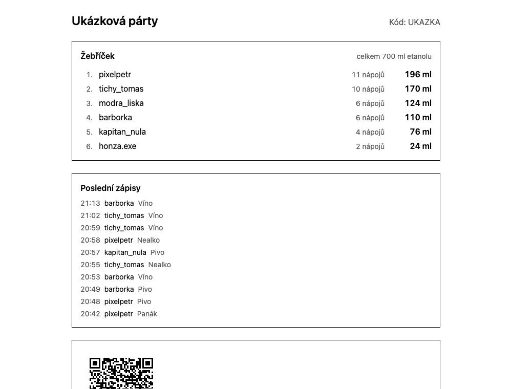

# Na ex

A real-time drinks board for a party. People log what they drink from their
phones by scanning a QR code; a shared screen - a TV, a laptop, a projector -
shows the standings as it happens.

**[Live demo](https://svelte-drinking-dashboard.svelte-drinking-dashboard.workers.dev/demo)** - fictional data, refreshed on a schedule.



The interface is in Czech. Ranking is by ethanol rather than by number of
drinks, so two shots beat five soft drinks.

A SvelteKit rebuild of a Next.js app that real people used at several events.

## Run it at your own party

Everything here fits inside the free tier of both services.

**1. A database.** Create a project on [Neon](https://neon.tech) and copy the
connection string.

```sh
git clone https://github.com/applepieas/svelte-drinking-dashboard
cd svelte-drinking-dashboard
pnpm install
cp .env.example .env          # put your connection string in DATABASE_URL
pnpm db:migrate
```

**2. Try it locally.** `pnpm dev`, open the address it prints, create an event,
and scan the QR code with a phone on the same network.

**3. Put it online.** Two Workers: the app, and a small one that owns the
schedule.

```sh
pnpm wrangler login

pnpm wrangler secret put DATABASE_URL         # the same connection string
pnpm wrangler secret put MAINTENANCE_SECRET   # openssl rand -hex 32
pnpm wrangler secret put RATE_LIMIT_SALT      # openssl rand -hex 32
pnpm build && pnpm wrangler deploy            # prints your URL

pnpm wrangler secret put MAINTENANCE_SECRET -c cron/wrangler.jsonc   # same value
pnpm wrangler deploy -c cron/wrangler.jsonc \
  --var MAINTENANCE_URL:https://<your-url>/api/udrzba
```

The scheduler runs every two minutes: it seeds the demo, keeps it moving, and
deletes events once their 30 days are up. Rename the Workers in
`wrangler.jsonc` and `cron/wrangler.jsonc` first if you like.

## How it works

**An append-only log, not a counter.** Every drink is a row; there is no `total`
column anywhere. Concurrent writes cannot clobber each other, undo is a
compensating row rather than a `DELETE`, and removing someone from the standings
leaves their history intact. `CHECK` constraints and partial unique indexes
enforce the log's shape in the database, because TypeScript unions stop at the
process boundary.

**Idempotence by unique index.** Every submission carries an id, unique per
event, so a double tap or a retried request resolves to one row.

**One reducer for the standings**, running during server rendering and again in
the browser as events arrive, so a live screen and a reloaded one cannot
disagree.

**Server-Sent Events, not WebSockets.** The flow is one-directional. Phones
write over ordinary form posts, and every message carries an `id:` so a screen
that loses its connection resumes from `Last-Event-ID`.

**The phone works without JavaScript.** Joining, logging, undoing, creating and
closing an event are all plain form posts. `use:enhance` adds optimistic updates
on top, and an end-to-end project runs the whole suite with JavaScript off to
keep it that way.

**Blood alcohol is estimated in the browser.** Weight and sex stay in
`localStorage` and are never sent anywhere. The estimate integrates minute by
minute instead of applying Widmark's formula directly, so alcohol is absorbed
gradually rather than all at once, and the floor at zero sits inside the loop so
elimination stops at sober instead of running up a debt.

**The demo is generated, never recorded.** Its timeline is a pure function of
the clock, so a given minute always produces the same drink by the same invented
person - which is what lets two overlapping scheduler runs collapse into one row.

## Fitting the free plan

Workers on the free plan allow 50 external subrequests and 10 ms of CPU per
invocation. Measured on the deployed Worker:

|                           | CPU      |
| ------------------------- | -------- |
| Stream, 39 polls          | 56 ms    |
| Stream, 5 polls           | 11 ms    |
| Screen render, warm       | 8–12 ms  |
| Screen render, cold start | 44–47 ms |

Roughly 1.2 ms per database query on top of ~10 ms just to invoke the Worker, so
no amount of tuning gets a render under the limit - that is the paid plan, not a
configuration change. What tuning does fix is the stream: it counts its own
queries and retires itself before it runs out, and the browser resumes from
`Last-Event-ID`. Cloudflare tolerates the overage, and nothing has been
terminated in practice, but this is the ceiling the design sits under.

The QR code is served from its own endpoint with an immutable cache rather than
rendered into the page, because encoding one was the most expensive thing the
screen did and it never changes for a given code.

## Tests

```sh
pnpm test                              # unit; integration too when TEST_DATABASE_URL is set
pnpm exec playwright install chromium
pnpm test:e2e                          # includes a run with JavaScript disabled
```

Integration and end-to-end tests need `TEST_DATABASE_URL` pointing at a
**separate** database - they create and delete rows, and a guard refuses to run
if it matches `DATABASE_URL`.

## Scripts

|                    |                                       |
| ------------------ | ------------------------------------- |
| `pnpm dev`         | dev server                            |
| `pnpm check`       | Wrangler types + `svelte-check`       |
| `pnpm lint`        | Prettier + ESLint                     |
| `pnpm db:generate` | write a migration from schema changes |
| `pnpm db:migrate`  | apply pending migrations              |

Built with SvelteKit, TypeScript, Svelte 5, Drizzle, Neon and Cloudflare Workers.
